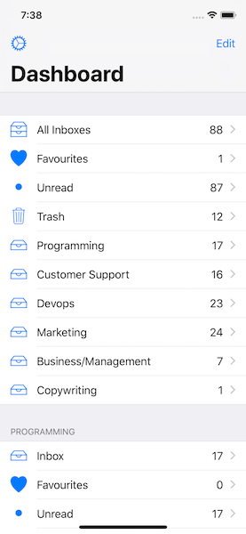
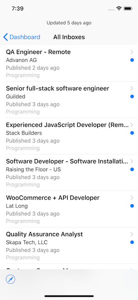
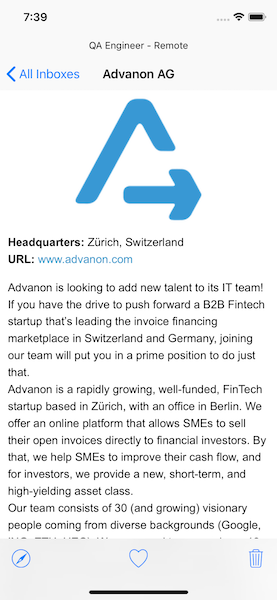

Wemotely - The Unofficial [WeWorkRemotely](https://weworkremotely.com) iOS Client

> Find the most qualified people in the most unexpected places: Hire remote! We Work Remotely is the largest community on the web to find and list jobs that aren't restricted by commutes or a particular geographic area.

This project was a fun and simple way to learn iOS development.





[](https://github.com/ChuckJHardy/Wemotely/blob/master/LICENSE)
[](https://github.com/ChuckJHardy/Wemotely)

### Releases

#### Alpha

- [x] `Feature` - iPhone + iPad Support
- [x] `Feature` - Dashboard
- [x] `Feature` - Settings
- [x] `Feature` - Select Active / Inactive Account
- [x] `Feature` - Jobs Per Account
- [x] `Feature` - Jobs for Multiple Account
- [x] `Feature` - Initial App Data Load
- [x] `Feature` - Unread Jobs
- [x] `Feature` - Favourite Jobs
- [x] `Feature` - Delete Jobs
- [x] `Feature` - Handle Duplicate Jobs
- [x] `Feature` - Pull To Refresh
- [x] `Feature` - Background Refresh
- [x] `Feature` - Open Job / Jobs in WWR
- [x] `Enhacement` - Dashboard Loading Screen
- [x] `Support` - Exception Tracking
- [ ] `Support` - Report a Bug https://github.com/ChuckJHardy/Wemotely/issues/14
- [ ] `Internal` - Feature Request Option https://github.com/ChuckJHardy/Wemotely/issues/13
- [ ] `Internal` - Setup TestFlight for Alpha Testers
- [ ] `Internal` - Link to Acknowledgments

#### Beta

- [ ] `Feature` - Daily New Job Notification
- [ ] `Feature` - Onboarding Options Flow
- [ ] `Enhancement` - Handle Inactive / Expired Jobs
- [ ] `Enhancement` - Silent Push Notifications Background Refresh
- [ ] `Enhancement` - Empty State Screen
- [ ] `Internal` - Analytic Tracking 
- [ ] `Internal` - Cancel Ongoing RSS Request
- [ ] `Support` - Telegram Support Group

#### Release 1

- [ ] `Feature` - Group Jobs by Company
- [ ] `Feature` - Bulk Actions for Jobs https://github.com/ChuckJHardy/Wemotely/issues/12
- [ ] `Enhancement` - Privacy Section in Settings
- [ ] `Internal` - Rate Now

#### Release 2

- [ ] `Feature` - Delete Jobs Forever
- [ ] `Feature` - 3D Touch Options
- [ ] `Feature` - Notifications Today Widget
- [ ] `Feature` - Dark Mode
- [ ] `Feature` - Auto Ignore Jobs Containing Words

### Installation

Run Setup Script

```
$ ./bin/setup
```

Update keys within `.env`

```
$ vim .env
export WEMOTELY_BUGSNAG_KEY="REAL_KEY"
```

[Carthage Package Manager](https://github.com/Carthage/Carthage)

```
$ brew install carthage swiftlint sourcery
$ carthage bootstrap --platform ios --no-use-binaries
```

### Useful Commands

Linter Autocorrect

```
swiftlint autocorrect
```

### Resources

* [App Icon Generator](http://appicon.co)

### Troubleshooting

#### Cleaning / Clearing

To clean the build folder, hold down the `Option` key while opening the `Product` menu, then choose `Clean Build Folder…`.

```
$ rm -rf Carthage
$ rm -rf ~/Library/Developer/Xcode/DerivedData
$ carthage update --platform ios; carthage build --platform ios
```

